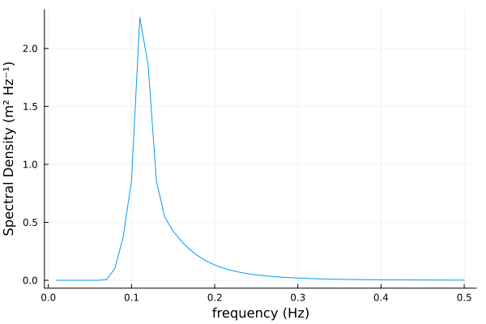
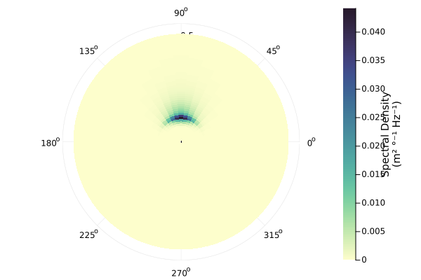
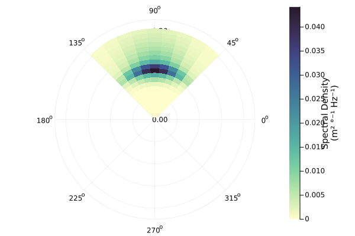
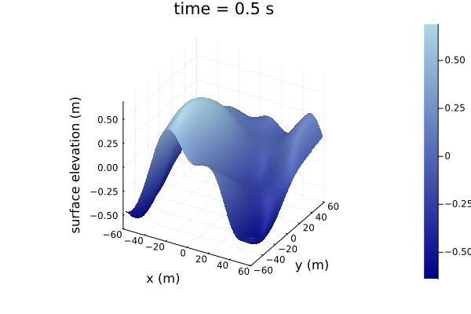
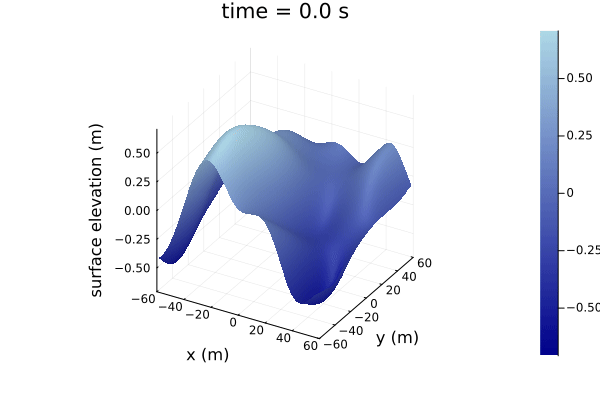

# [Quickstart](@id quickstart)

```julia
julia> using WaveSpectra, WaveRealizations, Plots

julia> f̅ = (0.01:0.01:0.5)*Hz
(0.01:0.01:0.5) Hz

julia> Hₛ=1.2m; fₑ=0.125*Hz; γ=3.3;

julia> S₀ = ParametricSpectra.spectrum_jonswap(f̅, Hₛ, fₑ, γ)
50-element OmnidirectionalSpectrum{m² Hz⁻¹}{Hz}
Spectral density of the quantity (m²):
  • Axis: Frequency (Hz)
and data(m² Hz⁻¹):
 0.0
 0.0
 1.5465133781175455e-106
 1.4125244620059736e-32
 1.1154358690894819e-12
 ⋮
 0.0023274934072044975
 0.002090985532205476
 0.001882696896258923
 0.0016987833490766532
 0.0015359864602957083

julia> θ̅ = (0°:10°:360°)[begin:end-1]
(0:10:350)°

julia> θₘ = 90°
90°

julia> spread = 20°
20°

julia> D = ParametricSpectra.spread_cartwright(θ̅, f̅, θₘ, spread);

julia> S = Spectrum(S₀, D);
```

```julia
julia> plot(S₀)
```

```julia
julia> plot(S)
```

```julia
julia> S_sub = Spectrum(S[frequency=0Hz..0.2Hz, direction=45°..135°])
plot(S_sub)
```

```julia
julia> Ã = ComplexAmplitudes(S_sub)
20×9 ComplexAmplitudes{m}{Hz}{°} with polar coordinates and axes:
  :frequency: [0.01 Hz, 0.02 Hz, 0.03 Hz, …, 0.18 Hz, 0.19 Hz, 0.2 Hz]
  :direction: [50°, 60°, 70°, …, 110°, 120°, 130°]
and data:
                    (-0.0 - 0.0im) m                                        (0.0 + 0.0im) m                     …                    (-0.0 + 0.0im) m
                     (0.0 + 0.0im) m                                        (0.0 + 0.0im) m                                           (0.0 - 0.0im) m
 (-1.4981720392028432e-55 + 1.5778678345789137e-55im) m  (-8.068406374775923e-56 - 6.1298873482541614e-55im) m      (4.676917572507604e-55 + 7.437170463693094e-56im) m
  (1.4316413238076151e-18 + 1.1826620513743503e-18im) m  (3.3929594376035634e-18 - 3.920609914179629e-18im) m       (2.288493960379759e-18 + 6.867217691524955e-18im) m
   (1.1423391669169332e-8 + 4.766264922824094e-8im) m     (1.2180518959292201e-8 + 1.21971664293489e-8im) m         (-6.924032775809924e-9 + 1.7729482186560884e-8im) m
                          ⋮                                                                                     ⋱  
  (-0.0074060935975469476 + 0.00992149158242508im) m      (-7.773459440711394e-6 + 0.011366785937089171im) m    …   (-0.011269555144007437 + 0.005644807730110364im) m
    (0.006062775476681223 - 0.007226157482580645im) m       (0.01597174120546653 - 0.0013851067700407355im) m         (0.00762179470989061 - 0.02400591718351112im) m
    (0.008878687327979867 + 0.0030080319346582444im) m      (0.00559048517277156 - 0.026644131776252217im) m         (0.008659553587462246 - 0.011721385360810332im) m
   (-0.006305202632985642 + 0.0016398260108754187im) m     (0.005141340548080684 + 0.006535731524371749im) m       (-0.0026329369816287178 - 0.00031477445490963696im) m
    (0.005499920722200309 - 0.00020431212260296587im) m    (0.003887577111590438 - 0.010622937132009614im) m         (0.015073961483072152 + 0.0055076688563272976im) m

julia> time = (0:0.5:20)s
(0.0:0.5:20.0) s

julia> x = y = (-1:0.01:1)*60m
(-60.0:0.6:60.0) m

julia> dispersion = DispersionRelations.gravitywaves_deepwater();

julia> η = WaveRealizations.WaveSurface(Ã; x, y, time, dispersion)
201×201×41 WaveSurface{m} with axes:
  :x: [-60.0 m, -59.4 m, -58.8 m, …, 58.8 m, 59.4 m, 60.0 m]
  :y: [-60.0 m, -59.4 m, -58.8 m, …, 58.8 m, 59.4 m, 60.0 m]
  :time: [0.0 s, 0.5 s, 1.0 s, …, 19.0 s, 19.5 s, 20.0 s]
and data:
201×201×41 Array{Unitful.Quantity{Float64, 𝐋, Unitful.FreeUnits{(m,), 𝐋, nothing}}, 3}:
[:, :, 1] =
 -0.418036 m  -0.412518 m  -0.406116 m  -0.398832 m  -0.390666 m  -0.381625 m  -0.371714 m  -0.360943 m  …  -0.338869 m    -0.332049 m   -0.325697 m   -0.319874 m   -0.314636 m   -0.310031 m
 -0.424789 m  -0.419117 m  -0.41254 m   -0.40506 m   -0.396681 m  -0.387411 m  -0.377257 m  -0.36623 m      -0.342413 m    -0.335336 m   -0.328704 m   -0.322578 m   -0.317017 m   -0.312069 m
 -0.431535 m  -0.425712 m  -0.418963 m  -0.411292 m  -0.402703 m  -0.393207 m  -0.382812 m  -0.371532 m     -0.345869 m    -0.338528 m   -0.331608 m   -0.325172 m   -0.319279 m   -0.313982 m
 -0.438263 m  -0.432294 m  -0.425376 m  -0.417516 m  -0.408722 m  -0.399002 m  -0.388371 m  -0.376841 m     -0.349236 m    -0.341624 m   -0.334408 m   -0.327655 m   -0.321424 m   -0.315769 m
 -0.444963 m  -0.438851 m  -0.431769 m  -0.423725 m  -0.414727 m  -0.404789 m  -0.393923 m  -0.382147 m     -0.352514 m    -0.344623 m   -0.337106 m   -0.330028 m   -0.323452 m   -0.317432 m
  ⋮                                                                ⋮                                     ⋱   ⋮                                                                      ⋮
 -0.106858 m  -0.113457 m  -0.120363 m  -0.127503 m  -0.134798 m  -0.142171 m  -0.149545 m  -0.156841 m     -0.0155581 m   -0.0317647 m  -0.047579 m   -0.0628848 m  -0.0775687 m  -0.0915209 m
 -0.106274 m  -0.112882 m  -0.119783 m  -0.126904 m  -0.134167 m  -0.141497 m  -0.148816 m  -0.156048 m     -0.013693 m    -0.0299106 m  -0.0457313 m  -0.0610379 m  -0.0757162 m  -0.0896559 m
 -0.105806 m  -0.112416 m  -0.119306 m  -0.1264 m    -0.133624 m  -0.140902 m  -0.148157 m  -0.155315 m     -0.0118088 m   -0.0280337 m  -0.0438573 m  -0.0591615 m  -0.0738313 m  -0.0877556 m
 -0.10545 m   -0.112058 m  -0.118929 m  -0.125991 m  -0.133168 m  -0.140386 m  -0.14757 m   -0.154645 m     -0.00990588 m  -0.0261346 m  -0.0419577 m  -0.0572564 m  -0.0719148 m  -0.0858211 m
 -0.105203 m  -0.111804 m  -0.118652 m  -0.125675 m  -0.132799 m  -0.13995 m   -0.147055 m  -0.154039 m  …  -0.00798463 m  -0.0242137 m  -0.0400331 m  -0.0553233 m  -0.0699675 m  -0.0838534 m
...
[:, :, 41] =
 -0.450506 m   -0.444073 m   -0.437151 m   -0.429806 m   -0.422104 m   -0.414108 m   -0.405879 m  -0.397478 m  …  -0.0562361 m  -0.0775108 m  -0.0992185 m  -0.121301 m   -0.143697 m    -0.166342 m
 -0.449837 m   -0.443094 m   -0.435863 m   -0.428213 m   -0.420212 m   -0.411925 m   -0.403418 m  -0.394752 m     -0.0545046 m  -0.0754771 m  -0.0968812 m  -0.118661 m   -0.140757 m    -0.163107 m
 -0.449115 m   -0.442069 m   -0.434535 m   -0.426585 m   -0.41829 m    -0.409718 m   -0.400938 m  -0.392013 m     -0.0528201 m  -0.0734879 m  -0.0945853 m  -0.116058 m   -0.137851 m    -0.159901 m
 -0.448344 m   -0.441001 m   -0.43317 m    -0.424926 m   -0.416343 m   -0.407492 m   -0.398445 m  -0.389267 m     -0.051185 m   -0.0715461 m  -0.0923342 m  -0.113498 m   -0.134982 m    -0.15673 m
 -0.447528 m   -0.439893 m   -0.431771 m   -0.42324 m    -0.414376 m   -0.405253 m   -0.395945 m  -0.386521 m     -0.0496013 m  -0.0696542 m  -0.0901312 m  -0.110983 m   -0.132157 m    -0.153597 m
  ⋮                                                                     ⋮                                      ⋱   ⋮                                                                      ⋮
  0.0360839 m   0.0104674 m  -0.0149342 m  -0.0400306 m  -0.0647326 m  -0.088953 m   -0.112607 m  -0.135613 m      0.0441244 m   0.0342064 m   0.0242652 m   0.0143473 m   0.00450005 m  -0.00522961 m
  0.0358114 m   0.0104224 m  -0.0147406 m  -0.0395886 m  -0.0640335 m  -0.0879896 m  -0.111374 m  -0.134105 m      0.0467316 m   0.0367118 m   0.0266649 m   0.0166394 m   0.00668423 m  -0.0031518 m
  0.0355154 m   0.010361 m   -0.0145563 m  -0.0391485 m  -0.0633292 m  -0.0870139 m  -0.110121 m  -0.132571 m      0.0493758 m   0.0392577 m   0.0291086 m   0.018979 m    0.00891948 m  -0.00101935 m
  0.0352024 m   0.0102893 m  -0.0143756 m  -0.0387054 m  -0.0626151 m  -0.0860215 m  -0.108844 m  -0.131007 m      0.0520518 m   0.0418391 m   0.0315917 m   0.0213619 m   0.0112021 m    0.00116446 m
  0.0348792 m   0.0102135 m  -0.0141926 m  -0.0382537 m  -0.0618862 m  -0.0850083 m  -0.107541 m  -0.12941 m   …   0.054754 m    0.044451 m    0.0341097 m   0.023784 m    0.0135282 m    0.00339623 m

julia> plot(η[time=0.5s])
```


```julia
julia> surface_gif(η)
```
